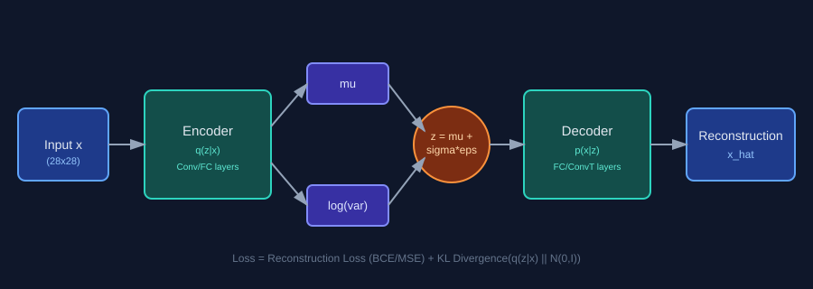
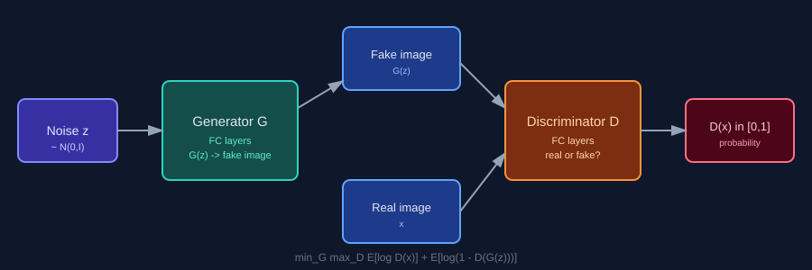
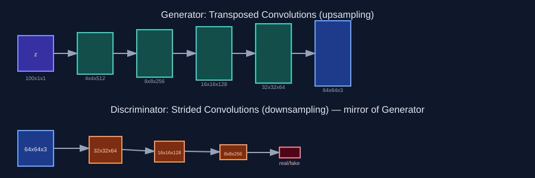
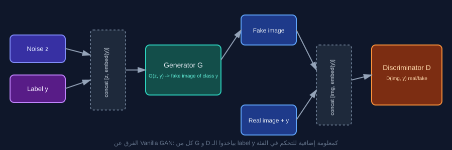
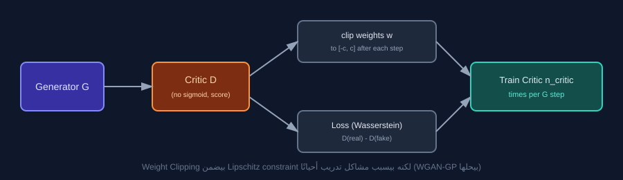
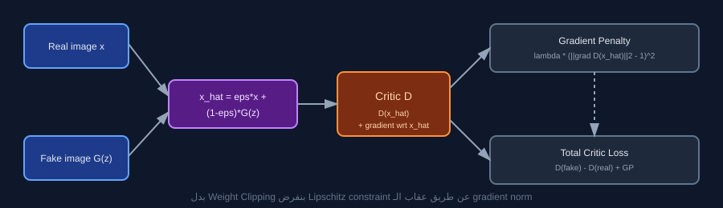

# GANs Journey — من VAE لحد WGAN-GP

ريبو تعليمي منظم بيمشي معاك خطوة بخطوة في عالم الـ **Generative Models**، بادئًا بـ **VAE** كمقدمة احتمالية، وبعدين مشوار كامل في تطور الـ **GANs** من أبسط شكل ليها لحد النسخ اللي حلّت مشاكل الاستقرار في التدريب.

كل فولدر شغّال لوحده بالكامل (model + train script + README تفصيلي)، وكلهم بيشتركوا في نفس أدوات الداتا والـ utilities الموجودة في `common/`.

## خريطة الطريق (Roadmap)

| # | الموديل | الفكرة الأساسية | الملف |
|---|---|---|---|
| 1 | **VAE** | Probabilistic latent space، تدريب بـ ELBO | [`01_VAE/`](./01_VAE) |
| 2 | **Vanilla GAN** | Adversarial training الأساسي (Goodfellow 2014) | [`02_Vallina_GAN/`](./02_Vallina_GAN) |
| 3 | **DCGAN** | استبدال الـ FC layers بـ Convolutions لتوليد صور أوضح | [`03_DCGAN/`](./03_DCGAN) |
| 4 | **Conditional GAN (cGAN)** | التحكم في الفئة (class) اللي بيتولد | [`04_Conditional_GAN/`](./04_Conditional_GAN) |
| 5 | **WGAN** | حل مشكلة عدم استقرار التدريب بـ Wasserstein distance | [`05_WGAN/`](./05_WGAN) |
| 6 | **WGAN-GP** | تحسين WGAN بـ Gradient Penalty بدل Weight Clipping | [`06_WGAP_GP/`](./06_WGAP_GP) |

---

## 1) VAE — Variational Autoencoder



بداية مختلفة تمامًا عن باقي الريبو: مفيش تنافس بين شبكتين، بس **Encoder** بيضغط
الصورة لتوزيع احتمالي `q(z|x) = N(mu, sigma²)`، و**Decoder** بيعيد بناء الصورة
من عينة `z` مأخوذة من التوزيع ده. بيتدرب بدالة **ELBO**:

```
Loss = Reconstruction_Loss + KL_Divergence(q(z|x) || N(0, I))
```

الفايدة الأساسية: latent space منظم وقابل للـ interpolation، وسهل نولّد منه
عينات جديدة بمجرد أخذ نويز من `N(0, I)` وتمريره للـ Decoder.
التفاصيل الكاملة والكود في [`01_VAE/README.md`](./01_VAE/README.md).

---

## 2) Vanilla GAN



أول صيغة لـ GAN — لعبة **minimax** بين Generator وDiscriminator:

```
min_G max_D   E[log D(x)] + E[log(1 - D(G(z)))]
```

المعمارية هنا بسيطة (FC layers بس) عشان نفهم الميكانيزم الأساسي قبل ما نعقّد
الموضوع بالـ Convolutions. بتعاني من مشاكل معروفة: **vanishing gradients** و
**mode collapse**. التفاصيل في [`02_Vallina_GAN/README.md`](./02_Vallina_GAN/README.md).

---

## 3) DCGAN — Deep Convolutional GAN



استبدال الـ FC layers بـ **Convolutions** (`Conv2d` في D، `ConvTranspose2d` في G)
مع مجموعة قواعد معمارية من ورقة Radford et al. 2015 (BatchNorm، إزالة الـ pooling،
ReLU/LeakyReLU محددة) بتخلي التدريب أكثر استقرارًا والصور أوضح بكتير.
التفاصيل في [`03_DCGAN/README.md`](./03_DCGAN/README.md).

---

## 4) Conditional GAN (cGAN)



إضافة الـ class label `y` كمعلومة إضافية لكل من G و D (عن طريق `nn.Embedding`
و concatenation) عشان نقدر **نتحكم** في نوع الصورة اللي بتتولد بدل ما تكون عشوائية.
التفاصيل في [`04_Conditional_GAN/README.md`](./04_Conditional_GAN/README.md).

---

## 5) WGAN — Wasserstein GAN



استبدال الـ loss المبني على JS Divergence بـ **Wasserstein distance**، اللي
بتوفر gradients أفضل وتدريب أكثر استقرارًا. بيتطلب فرض شرط **1-Lipschitz**
على الـ critic، وهنا بيتحقق عن طريق **Weight Clipping**.
التفاصيل في [`05_WGAN/README.md`](./05_WGAN/README.md).

---

## 6) WGAN-GP — WGAN with Gradient Penalty



بدل Weight Clipping (اللي بيسبب مشاكل تدريب)، بنفرض شرط الـ Lipschitz عن طريق
**عقاب الـ gradient norm** مباشرة (`Gradient Penalty`)، وده بيدي استقرار وجودة
أفضل بكتير في التدريب. التفاصيل في [`06_WGAP_GP/README.md`](./06_WGAP_GP/README.md).

---

## هيكل الريبو

```
GANs-Journey/
├── 01_VAE/                 # Variational Autoencoder
│   ├── model.py             # Encoder, Decoder, VAE, vae_loss_function
│   ├── train.py             # حلقة التدريب الكاملة
│   └── README.md
├── 02_Vallina_GAN/          # Vanilla GAN (Goodfellow 2014)
│   ├── model.py             # Generator, Discriminator (FC layers)
│   ├── train.py
│   └── README.md
├── 03_DCGAN/                # Deep Convolutional GAN
│   ├── model.py             # Generator, Discriminator (Conv layers)
│   ├── train.py
│   └── README.md
├── 04_Conditional_GAN/      # cGAN — توليد مشروط بالـ class label
│   ├── model.py             # Generator, Discriminator + Embedding
│   ├── train.py
│   └── README.md
├── 05_WGAN/                 # Wasserstein GAN + Weight Clipping
│   ├── model.py             # Generator, Critic
│   ├── train.py
│   └── README.md
├── 06_WGAP_GP/              # WGAN + Gradient Penalty
│   ├── model.py             # Generator, Critic (بدون BatchNorm)
│   ├── train.py             # فيها compute_gradient_penalty()
│   └── README.md
├── common/
│   └── utils.py             # دوال مشتركة: dataloader, weights_init, plotting, saving
├── docs/
│   └── images/              # الدايجرامات المستخدمة في كل الـ READMEs
├── src/                      # كود إضافي عام (لو احتجت تحط حاجة مشتركة مش في common)
├── pyproject.toml
├── uv.lock
└── README.md                 # الملف ده
```

## المتطلبات والتثبيت

المشروع بيستخدم [`uv`](https://github.com/astral-sh/uv) لإدارة الحزم والبيئة الافتراضية.

```bash
# تثبيت uv لو مش موجود
pip install uv

# إنشاء البيئة الافتراضية وتثبيت المكتبات
uv venv
.venv\Scripts\activate        # على ويندوز
# source .venv/bin/activate   # على Linux/macOS

uv add "torch>=2.0.0" "torchvision>=0.15.0" "numpy>=1.24.0" "matplotlib>=3.7.0" "scipy>=1.10.0" "tqdm>=4.65.0"
```

أو لو بتستخدم `pip` مع `requirements.txt` عادي:

```bash
pip install -r requirements.txt
```

## تشغيل أي موديل

كل موديل مستقل بالكامل. ادخل الفولدر بتاعه وشغّل `train.py`:

```bash
cd 03_DCGAN
python train.py --epochs 30 --batch-size 128
```

كل سكريبت بيقبل `--epochs`, `--batch-size`, `--lr` كحد أدنى، وباراميترات إضافية
خاصة بكل موديل (زي `--n-critic` و `--clip-value` في WGAN، أو `--num-classes` في cGAN).
شوف الـ README الخاص بكل فولدر لتفاصيل كاملة عن الباراميترات.

المخرجات (عينات مولّدة + منحنى الخسارة + أوزان الموديل) بتتحفظ تلقائيًا في
فولدر `outputs/` جوه كل موديل.

## جدول مقارنة سريع

| الموديل | Loss Function | الـ Discriminator بيرجع | استقرار التدريب | جودة الصور |
|---|---|---|---|---|
| VAE | Reconstruction + KL | - | مستقر جدًا | متوسطة (blurry) |
| Vanilla GAN | Binary Cross-Entropy | احتمالية [0,1] | ضعيف | متوسطة |
| DCGAN | Binary Cross-Entropy | احتمالية [0,1] | متوسط-جيد | جيدة |
| cGAN | Binary Cross-Entropy (+ label) | احتمالية [0,1] | متوسط | جيدة + قابلة للتحكم |
| WGAN | Wasserstein distance | score حر | جيد | جيدة |
| WGAN-GP | Wasserstein + Gradient Penalty | score حر | ممتاز | ممتازة |

## مصادر للقراءة أكتر

- Kingma & Welling, *Auto-Encoding Variational Bayes*, 2013
- Goodfellow et al., *Generative Adversarial Networks*, 2014
- Radford et al., *Unsupervised Representation Learning with DCGANs*, 2015
- Mirza & Osindero, *Conditional Generative Adversarial Nets*, 2014
- Arjovsky et al., *Wasserstein GAN*, 2017
- Gulrajani et al., *Improved Training of Wasserstein GANs*, 2017
